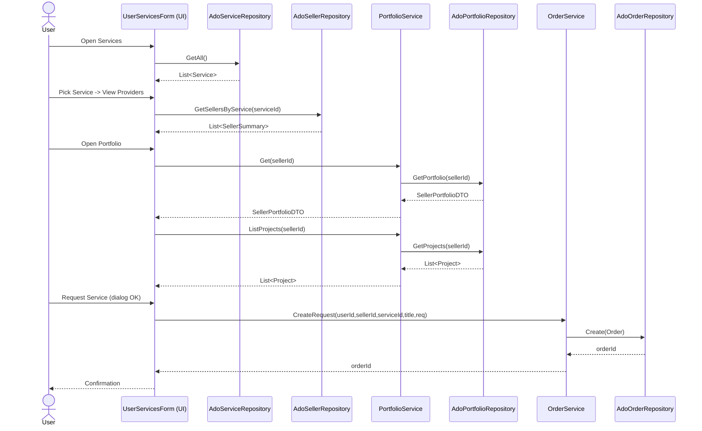
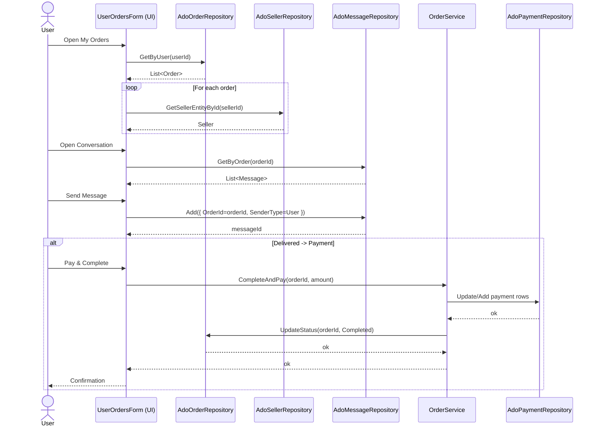
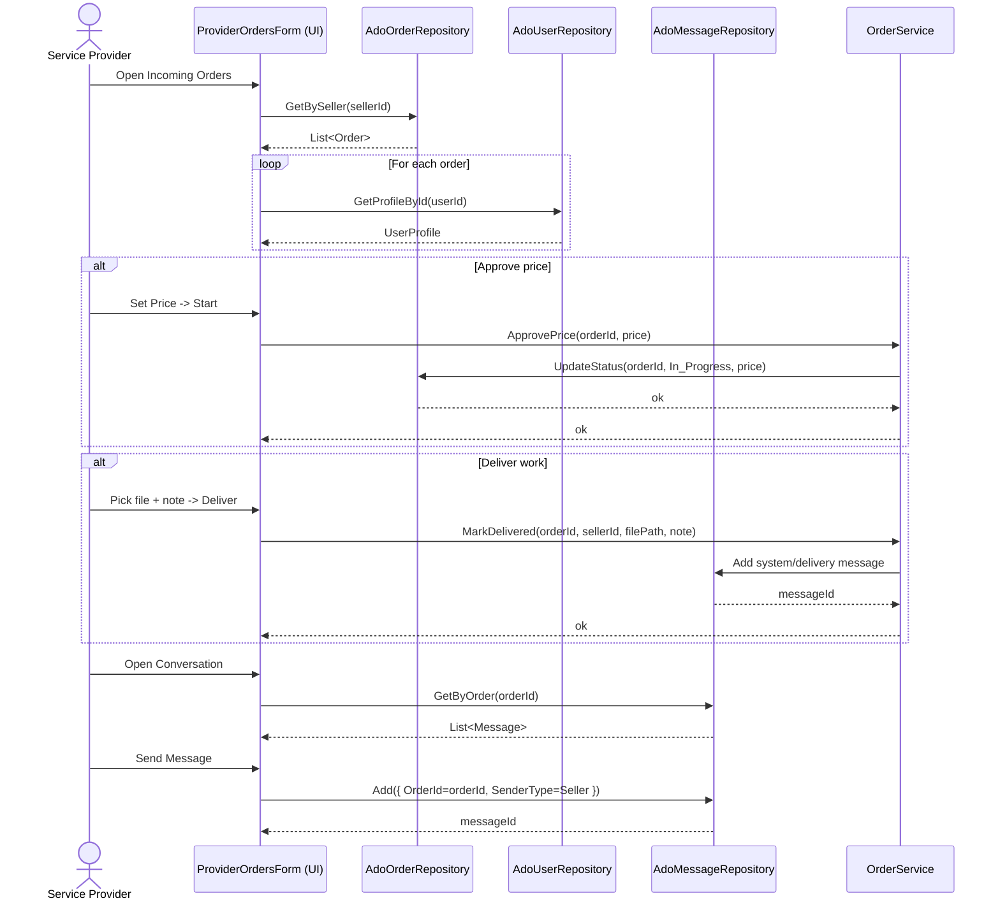
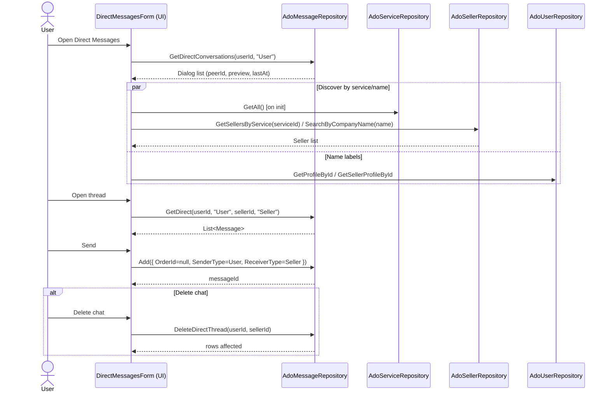
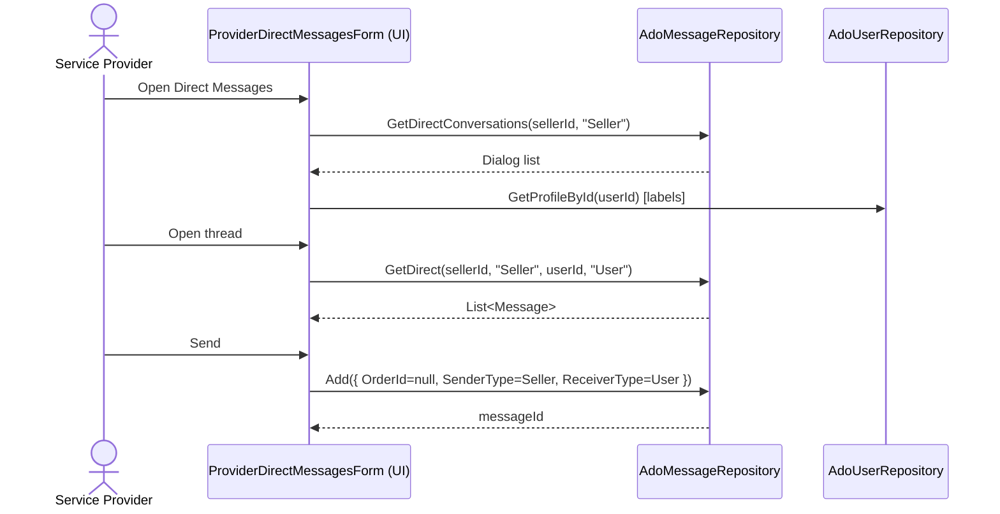

# Deeper call graphs and sequence diagrams

This document drills into end-to-end calls for each UI flow, tying Forms -> Services -> Repositories -> DB operations. Mermaid diagrams are included for sequence views.

Legend
- UI/Forms: rectangles
- Services: rounded rectangles
- Repos: cylinders (DB access via ADO)
- Tables (from migrations) are noted next to repo calls

----------------------------------------

1) User services browsing -> providers -> portfolio -> request order

Call graph (static)
- Forms/User/UserServicesForm
 - ShowServices
 - AdoServiceRepository.GetAll -> SELECT id,name FROM services (services)
 - ShowServiceSellers(serviceId)
 - AdoSellerRepository.GetSellersByService(serviceId)
 - LEFT JOIN seller_portfolios (summary) (sellers + seller_portfolios)
 - ShowSellerPortfolio(sellerId)
 - PortfolioService.Get
 - AdoPortfolioRepository.GetPortfolio (seller_portfolios)
 - PortfolioService.ListProjects
 - AdoPortfolioRepository.GetProjects (seller_projects)
 - RequestOrderDialog -> OrderService.CreateRequest(userId, sellerId, serviceId, title, requirements)
 - AdoOrderRepository.Create (orders)

Sequence (Mermaid)


----------------------------------------

2) User orders -> order chat -> pay & complete

Call graph (static)
- Forms/User/UserOrdersForm
 - LoadOrders
 - AdoOrderRepository.GetByUser (orders)
 - AdoSellerRepository.GetSellerEntityById (sellers)
 - OpenConversation(order)
 - IMessageRepository.GetByOrder (messages)
 - Send: IMessageRepository.Add (messages)
 - Pay & Complete: OrderService.CompleteAndPay
 - AdoPaymentRepository + AdoOrderRepository.UpdateStatus (payments, orders)

Sequence (Mermaid)


----------------------------------------

3) Provider orders -> approve price -> deliver -> order chat

Call graph (static)
- Forms/ServiceProvider/ProviderOrdersForm
 - LoadOrders
 - AdoOrderRepository.GetBySeller (orders)
 - AdoUserRepository.GetProfileById (users)
 - OpenConversation(order)
 - IMessageRepository.GetByOrder (messages)
 - Send: IMessageRepository.Add (messages)
 - Approve price: OrderService.ApprovePrice
 - AdoOrderRepository.UpdateStatus (orders) inc. price
 - Deliver: OrderService.MarkDelivered
 - Save file (data/orders/{id}/deliveries)
 - AdoMessageRepository.Add (messages)

Sequence (Mermaid)


----------------------------------------

4) Direct messaging (user side): discover sellers -> open thread -> send -> delete chat

Call graph (static)
- Forms/User/DirectMessagesForm
 - LoadPeers
 - IMessageRepository.GetDirectConversations(userId, "User") (messages)
 - Name resolution: AdoSellerRepository.GetSellerProfileById / AdoUserRepository.GetProfileById
 - DoSearch
 - AdoServiceRepository.GetAll (services) – pre-populated
 - AdoSellerRepository.GetSellersByService(serviceId) OR SearchByCompanyName(name)
 - LoadThread
 - IMessageRepository.GetDirect(userId, "User", sellerId, "Seller")
 - Send
 - IMessageRepository.Add({ OrderId=null, SenderType=User, ReceiverType=Seller })
 - Delete chat
 - IMessageRepository.DeleteDirectThread(userId, sellerId)

Sequence (Mermaid)


----------------------------------------

5) Direct messaging (provider side): open thread -> send

Call graph (static)
- Forms/ServiceProvider/ProviderDirectMessagesForm
 - LoadPeers
 - IMessageRepository.GetDirectConversations(sellerId, "Seller")
 - Name resolution: AdoUserRepository.GetProfileById(userId)
 - LoadThread
 - IMessageRepository.GetDirect(sellerId, "Seller", userId, "User")
 - Send
 - IMessageRepository.Add({ OrderId=null, SenderType=Seller, ReceiverType=User })

Sequence (Mermaid)


----------------------------------------

6) Provider portfolio: edit/save, add project, delete project

Call graph (static)
- Forms/ServiceProvider/ServiceProviderPortfolioForm
 - Build() fetch
 - PortfolioService.Get -> AdoPortfolioRepository.GetPortfolio (seller_portfolios)
 - PortfolioService.ListProjects -> AdoPortfolioRepository.GetProjects (seller_projects)
 - Save
 - PortfolioService.Save -> AdoPortfolioRepository.UpsertPortfolio (seller_portfolios)
 - Add Project
 - PortfolioService.AddProject -> AdoPortfolioRepository.AddProject (seller_projects)
 - Delete Project
 - PortfolioService.DeleteProject -> AdoPortfolioRepository.DeleteProject (seller_projects)

Sequence (Mermaid)
```mermaid
sequenceDiagram
 actor SP as Service Provider
 participant F as ServiceProviderPortfolioForm (UI)
 participant S as PortfolioService
 participant R as AdoPortfolioRepository

 SP->>F: Open Portfolio
 F->>S: Get(sellerId); ListProjects(sellerId)
 S->>R: GetPortfolio / GetProjects
 R-->>S: DTO / List<Project>
 S-->>F: Data
 alt Save portfolio
 SP->>F: Save
 F->>S: Save(desc, price, skills, pic)
 S->>R: UpsertPortfolio
 R-->>S: ok
 S-->>F: ok
 end
 alt Add project
 SP->>F: Add Project
 F->>S: AddProject(title, desc, img)
 S->>R: AddProject
 R-->>S: projectId
 S-->>F: projectId
 end
 alt Delete project
 SP->>F: Delete Project
 F->>S: DeleteProject(projectId, sellerId)
 S->>R: DeleteProject
 R-->>S: ok
 S-->>F: ok
 end
```

----------------------------------------

Cross-cutting behavior
- Name resolution for labels
 - Users: `AdoUserRepository.GetProfileById(id)`
 - Sellers: `AdoSellerRepository.GetSellerProfileById(id)` or `GetSellerEntityById`
- Messaging
 - Order chat: messages with `orderid = value`
 - Direct chat: messages with `orderid IS NULL`, with `senderid/sendertype` and `receiverid/receivertype`
- Attachments & deliveries
 - Persisted under app `data/orders/{orderId}/attachments|deliveries`
- Paging/limits
 - Current queries fetch full threads; introduce LIMIT/OFFSET in repos for long histories if needed.

Notes for maintainers
- All repos use parameterized MySQL queries via `AdoDbContext`.
- Direct chat DELETE uses `IMessageRepository.DeleteDirectThread` to remove rows for a user<->seller pair where `orderid IS NULL`.
- Scrolling and layout: forms use `FlowLayoutPanel` or panels with `AutoScroll` to fit within dashboard content areas.
